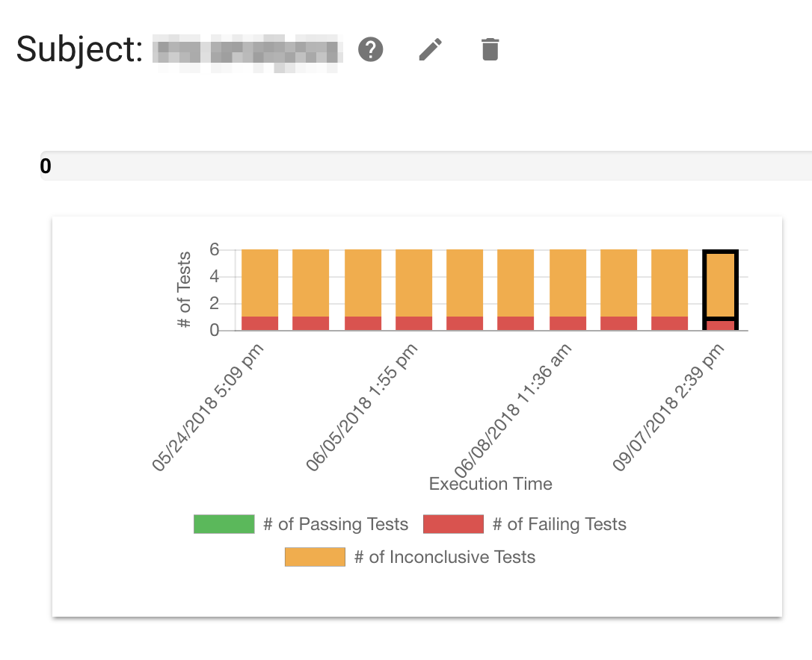

# Chaos Engineering Case Study : HomeAway

> How HomeAway used the Chaos Toolkit and Toxiproxy to explore and surface system weaknesses

A while back a couple of [Chaos Toolkit][chaostoolkit] community members got in contact on [Slack][chaostoolkit-slack] to ask if they could contribute a new [Toxiproxy][toxiproxy] driver to the [Chaos Toolkit Incubator][chaostoolkit-incubator]. Always delighted when the community drives these projects forward, [ChaosIQ][chaosiq] worked with the contributors to bring this new driver into the incubator, and in the process we got an opportunity to ask them about their own unique Chaos Engineering story and experiences with the Chaos Toolkit.

It turned out that the [Toxiproxy driver][toxiproxy-driver] was just the tip of the Chaos Engineering iceberg. Captured in the following interview is our conversation with the contributors Eduardo Solis and David Sumera and how the Chaos Toolkit has helped them improve system robustness by exploring, discovering and overcoming system weaknesses on [HomeAway][homeaway]. HomeAway has the best websites to find and book the perfect place to stay connecting travellers to the people and places they love.

[chaostoolkit]: https://chaostoolkit.org/
[chaostoolkit-slack]: https://join.chaostoolkit.org/
[toxuproxy]: https://github.com/shopify/toxiproxy
[chaostoolkit-incubator]: https://github.com/chaostoolkit-incubator
[chaosiq]: https://chaosiq.io/
[toxuproxy-driver]: https://github.com/chaostoolkit-incubator/chaostoolkit-toxiproxy
[homeaway]: https://www.homeaway.com/

Summary:

* HomeAway have taken full advantage of the extensibility of the Chaos Toolkit to integrate it with their CI/CD pipeline, various bespoke tools, and even contributed a general-purpose Toxiproxy driver back to the Chaos Toolkit Incubator.
* Just the process of collaborating on Chaos Toolkit experiments can lead to architectural and design improvements before anything is even built.
* The Chaos Toolkit’s Experiment vocabulary was a big win when attempting to collaborate on a chaos experiment.
* HomeAway has integrated the output of running experiments into a Scorecard system that teams use to know what experiments and tests are running and are encountering any weaknesses/failures.
* State management and sharing between steps in an experiment would be the next feature they’d love to see make it into the Chaos Toolkit.

## Using, Extending and Integrating the Chaos Toolkit

***(ChaosIQ) Russ:>*** **Hello! How did you come to the Chaos Toolkit for your Chaos Engineering (and why)?**

***(HomeAway) Eduardo:>*** Initially we really liked the Chaos Toolkit’s experiment vocabulary, that was a big win for us as we could easily express and communicate our experiments to everyone that needed to know about them.

***(HomeAway) David:>*** And then came the plug-ability of the toolkit. Through it being a command line interface, and having the plugins and drivers APIs we could customise the chaos it causes easily. We have our own custom system and we wanted to cause targeted chaos there, and so it was best to create our own in-house drivers.

***(HomeAway) Eduardo:>*** Right… we have a PaaS (Platform as a Service) and it has its own API so we needed something very flexible. Mesos and Marathon are at the core of our PaaS.

***(ChaosIQ) Russ:>*** **And then you made the jump to integrate Toxiproxy into your system and your Chaos Toolkit as well?**

***(HomeAway) Eduardo:>*** Yes, we embraced toxiproxy as another chaos-causing system as we liked the `toxic`s that could be introduced to a pool of toxiproxy instances across our system.

*Chaos Toolkit in the HomeAway CI/CD pipeline where it’s used as a test driver to orchestrate ‘simulated chaos’*

***(ChaosIQ) Russ:>*** **What was the most difficult challenge you faced during the project?**

***(HomeAway) Eduardo:>*** The difficult part for us was to achieve the “pretend-chaos” where we needed to make dependencies of an app look either broken or degraded. That is when we looked at toxiproxy. All of our cloud services leverage a Service Mesh (currently LinkerD), and our Service Mesh takes an “override” rule out of the box. So we can tell it, “hey, instead of sending traffic for this request route it to X”. So this was on the money for us… we could then create a Chaos Toolkit extension that understood our PaaS to figure out what to attack.

***(ChaosIQ) Russ:>*** **How do you mean by “on the money”, were things traced back to actual money?**

***(HomeAway) Eduardo:>*** Yes, absolutely. We had some hard, income-related stats through our observability work that showed that putting effort into resilience was a valuable idea, and the Chaos Toolkit pluggability helped us do that as simply as possible.

***(ChaosIQ) Russ:>*** **At this point you have one internal driver you’re using, and then there’s the toxiproxy one also?**

***(HomeAway) Eduardo:>*** Exactly, but the toxiproxy part was completely free of custom stuff so we had the idea to offer it back through the Chaos Toolkit Incubator.

***(ChaosIQ) Russ:>*** **Right now how many apps and services are being subjects to chaos using the Chaos Toolkit and your custom extensions?**

***(HomeAway) Eduardo:>*** Around 5 apps are using the toxiproxy extension and Chaostoolkit, comprised of “minilith” services. The interesting thing is that a lot are moving away from REST everywhere towards using eventually consistent/CQRS-based approaches instead.

***(ChaosIQ) Russ:>*** **Very interesting! Do you apply chaos to those style of services and integrations yet?**

***(HomeAway) Eduardo:>*** We are thinking about messing with data… sending poison pills, etc.

# Teams and Adoption of Chaos Engineering

***(ChaosIQ) Russ:>*** **How many people in the company are actually writing and/or executing experiments?**

***(HomeAway) Eduardo:>*** It is fairly new, so as of now we have 3 or 4 teams playing with this, but we also created an internal “community of practice” with representatives of every “domain” in the company taking part.

***(HomeAway) David:>*** I think most/all teams are 1–2 pizzas.

***(HomeAway) Eduardo:>*** … and a “domain” is made of several of those small teams.

***(ChaosIQ) Russ:>*** **So approximately 20 people are playing with the chaos?**

***(HomeAway) Eduardo:>*** I think about 20 so far. In addition we’ve created something called a scorecard and we plugged the Chaos Toolkit reporting into it. It’s a backend service that can aggregate the data when chaos experiments are run:

*Screenshot of aggregate data on chaos experiments sourced from custom extensions to the Chaos Toolkit reporting extension.*

***(HomeAway) Eduardo:>*** The idea for this is that you catalog what your app does (it is an http based service, it has 3 critical dependencies, 2 dependencies that can go down), then it creates a “list” of experiments that should be tried and verifies that the team is testing everything in the catalog and that everything is passing. In this case all the data came from Chaos Toolkit but we can send the data from multiple tools including a couple homegrown ones. We actually on-boarded the homegrown one first but the Chaos Toolkit reporting was so flexible that we ended up integrating it in a couple days.

***(ChaosIQ) Russ:>*** **How are you extracting the data from the toolkit, from the journal itself or the CLI output perhaps?**

***(HomeAway) Eduardo:>*** We use and parse the journal. We created a reporting extension to look at the journal and push to our backend. In terms of packaging, internally what we do is create a docker image with the core Chaos Toolkit plus our extensions and then we can integrate in our CI/CD pipeline, or you can just run it. We made our docker image such that you can actually install other extensions on the fly if a team wants to. It’s all about trying to give teams flexibility.

*The Chaos Toolkit packaged with HomeAway specific extensions running inside a Docker container.*

***(ChaosIQ) Russ:>*** **It sounds like you’ve really made the most of the plug-ability and extensibility of the Chaos Toolkit!**

***(HomeAway) Eduardo:>*** Here’s what we’ve done:

***(HomeAway) Eduardo:>*** `metrics` is a little extension that can pull instances or pool level metrics to create assertions. For example it can provide real-time data on “errors per second” or “error count”. `mot` is our PaaS API; it can deploy, undeploy, restart, etc. request is the extension that can do
authn/authz, routes override and rates.

***(HomeAway) David S.:>*** `docker` complements the `mot` work — you can append image tags with `-CHAOS` for custom deployments (helps with tracking/auditing).

## Learning through Chaos, and Next Steps

***(ChaosIQ) Russ:>*** **Are you finding system weaknesses through the use of chaos?**

***(HomeAway) Eduardo:>*** What we have found so far is that when we sit with a team to plan the experiment, that is when the light goes on… they start realising how many things they missed and they start cataloging what bad things could happen if something goes bad… so by the time they write the experiment they have fixed some stuff and, in one case, even some pieces were rearchitected.

***(ChaosIQ) Russ:>*** **What are your next steps?**

***(HomeAway) Eduardo:>*** We are trying to see if people find the scorecard valuable and we are starting with something much simpler like teams really sharing their SLOs, understanding their dependencies and working with the community to make this standard practice. We’re working towards having a good catalog of what things to go and explore.

***(ChaosIQ) Russ:>*** **What features would you love to see in the Chaos Toolkit, or even in the Chaos Hub and Platform?**

***(HomeAway) David S.:>*** State management! I think that’s the biggest ask we would have so far. Being able to set variables to be used in other states, and possibly modify the experiment’s `configuration` block. Right now we’re using the python environment, which feels wrong.

***(ChaosIQ) Russ:>*** **Thanks so much for this interview and sharing so much of your experiences on your chaos engineering journey so far!**

***(HomeAway)*** Thank you so much! This was fun.
